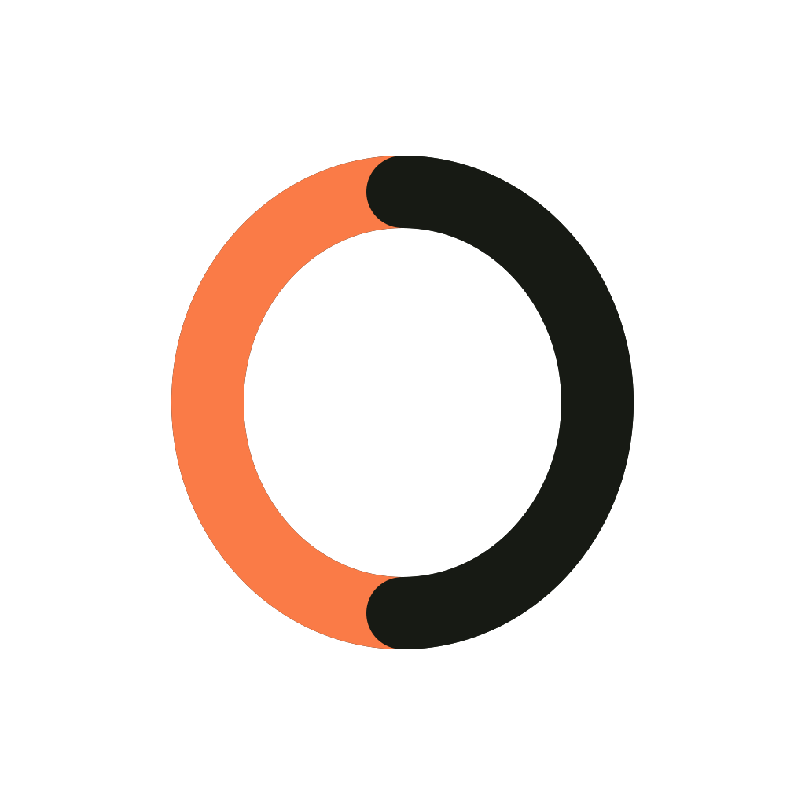

  

<h1 align="center">Goose Studio</h1>

Create images, videos, 3D models, and voxel models using your own Modal account and credits.

  <a href="https://github.com/Kokkini/GooseStudio/releases/download/v1.1.6/Goose-Studio-Setup-1.1.6.exe"><strong>Download for Windows</strong></a>
  ·
  <a href="https://github.com/Kokkini/GooseStudio/releases">All releases</a>

Goose Studio helps you create images, videos, 3D models, and voxel models using your own Modal account and credits.

## What you can make

- Create an image from a prompt
- Edit an image
- Try clothing on a person
- Swap a character in a video
- Upscale an image
- Turn an image into a textured 3D model
- Turn a 3D model into a MagicaVoxel `.vox` file

## Before you start

You need:

- A 64-bit Windows 10 or Windows 11 computer
- A Modal account with credits
- An internet connection

The Windows app includes everything it needs. You do not need to install Python, Docker, Git, WSL, or the Modal command-line tools.

## Get started

1. [Download the latest Windows installer (v1.1.6)](https://github.com/Kokkini/GooseStudio/releases/download/v1.1.6/Goose-Studio-Setup-1.1.6.exe).
2. Install and open Goose Studio.
3. Select **Setup Modal** and follow the instructions in the app.
4. When asked, paste the complete token command copied from Modal. Never share that command with anyone.
5. Start with **Create an image from a prompt**. Other tools can be installed when you first choose them.

Goose Studio uses your Modal account for setup and generation. The app shows your available Modal credits and an approximate cost before you start a task. Modal's usage page shows the final cost.

## Create something

Choose a tool, add an image or description, adjust its settings, and select **Generate**. You can switch to another tool while a task is running; Modal can process tasks in parallel.

Finished work appears under **Your creations**. Open an item to view or download it, or delete it to remove it from the list and from the app's Modal storage.

Your files are sent directly to your own Modal workspace. Goose Studio does not provide a separate storage service for your media.

## Settings and help

The **Settings** menu lets you:

- View the latest Goose Studio log
- Connect a different Modal account
- Open Modal's usage page

If something goes wrong, open the technical details in the app's error or setup panel. They contain the information needed to diagnose the problem without putting the full error message in the main status card.

## Updates

Download newer versions from the [Releases page](https://github.com/Kokkini/GooseStudio/releases) and install them over the existing version. Your Modal connection and app settings remain on your computer.
